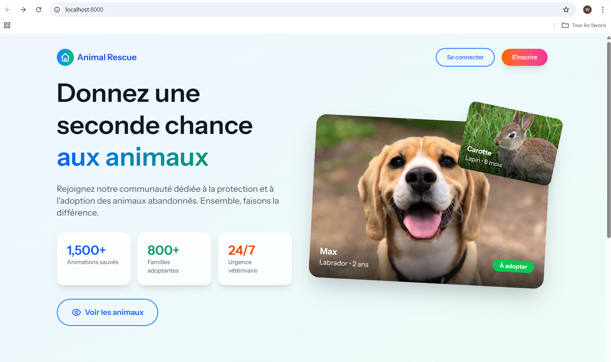
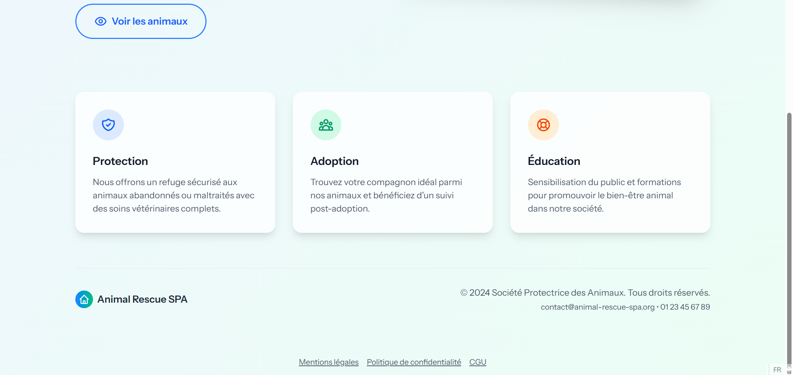
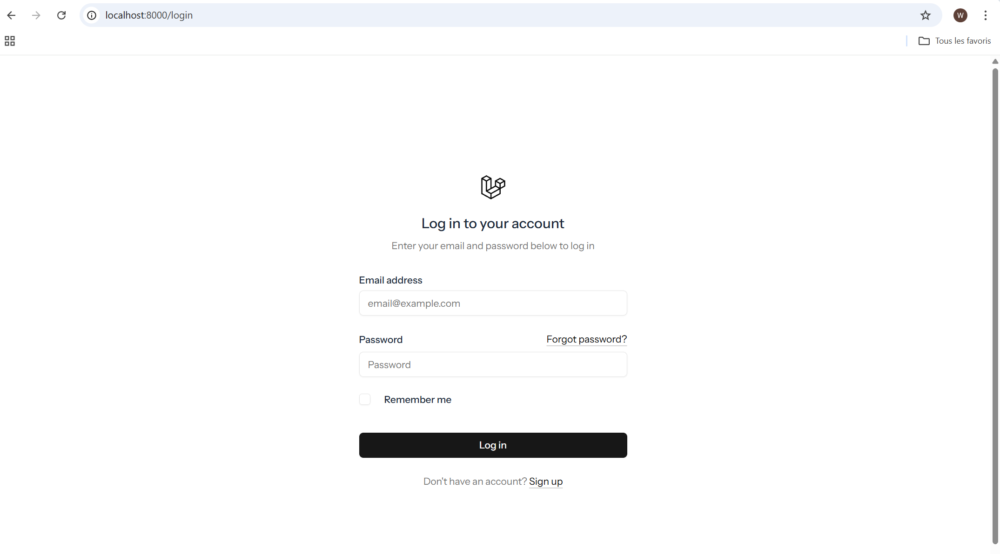
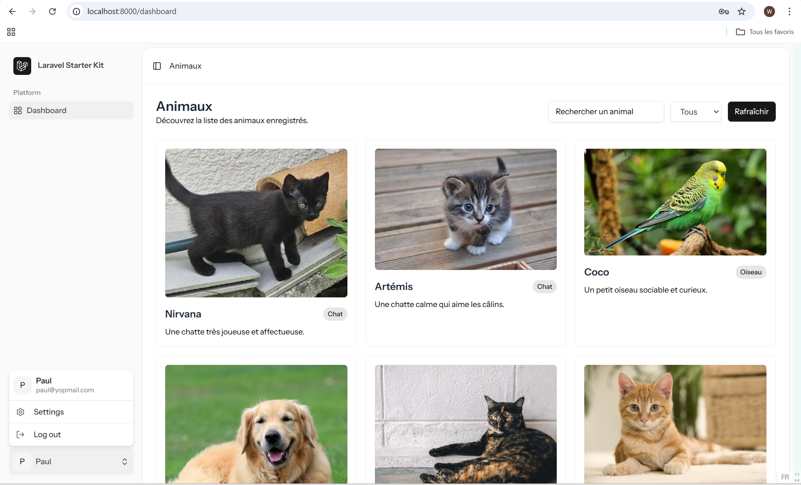

# Projet SPA - Animaux

## Contexte du Projet

Ce projet a été réalisé dans le cadre du cours de **Sécurité Web** ayant pour objectif la conception et le développement d'une application web sécurisée. L'accent a été mis sur l'implémentation des bonnes pratiques de sécurité tout au long du cycle de développement.<br>
En utilisant Laravel, nous bénéficions d'un framework qui intègre nativement de nombreuses protections, tout en nous permettant d'ajouter des couches de sécurité supplémentaires spécifiques à notre domaine.

## Prérequis

- PHP 8.2 (vérifier la version compatibilité avec le projet)
- Composer
- Node.js (16+) et npm
- Base de données (MySQL)
- Git

---

## 1) Cloner le dépôt

```bash
git clone <URL_DU_DEPOT>
cd <nom_du_dossier>
```

Remplacez `<URL_DU_DEPOT>` par l'URL du dépôt Git et `<nom_du_dossier>` par le répertoire créé.

---

## 2) Installer les dépendances backend

```bash
composer install
```

Si vous rencontrez des problèmes de mémoire lors de `composer install`, réessayez avec plus de mémoire :

```bash
COMPOSER_MEMORY_LIMIT=-1 composer install
```

---

## 3) Installer les dépendances frontend

```bash
npm install
# ou si vous utilisez pnpm
# pnpm install
```

---

## 4) Configuration de l'environnement

Copiez le fichier d'exemple `.env.example` vers `.env` :

```bash
cp .env.example .env
```

Puis éditez `.env` pour configurer la connexion à la base de données :

- Pour MySQL/MariaDB ou PostgreSQL :
    - DB_CONNECTION=mysql
    - DB_HOST=127.0.0.1
    - DB_PORT=3306
    - DB_DATABASE=nom_de_la_base
    - DB_USERNAME=utilisateur
    - DB_PASSWORD=mot_de_passe

- Une fichier .env spécial contenant le mot de passe et le domaine admin vous serez envoyer pour créer un compte admin .Sinon créer un compte utilisateur et changer directement dans la bdd le role user en admin.

Générez la clé d'application Laravel :

```bash
php artisan key:generate
```

---

## 5) Migrer la base et lancer les seeders

Pour créer les tables et insérer les données :

```bash
php artisan migrate --seed
```

- ***

## 6) Lancer l'application en développement

Ce projet utilise le framework Laravel. Ouvrez le terminal et lancez la commande suivant.

Terminal :

```bash
composer run dev
```

Ensuite ouvrez dans le navigateur :

- http://127.0.0.1:8000

---

## Les pages du site






